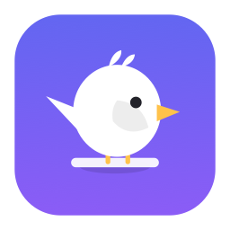

<div align="center">



# Perch

### Your AI agents work. Perch watches. You get a tap on the shoulder.

A tiny macOS menu-bar bird that keeps an eye on **Claude Code, Cursor, and Codex** —
and pings you the second one **finishes** or **needs your input**.
No more babysitting a long task, only to find it stalled on an *"Allow this command?"* prompt ten minutes ago.

<br>

[](https://github.com/Scratchhhh/Perch/releases/latest)
[](project.yml)
[](https://github.com/Scratchhhh/Perch/releases/latest)
[](https://github.com/Scratchhhh/Perch/releases)
[](LICENSE)

<br>

### [⬇&nbsp; Download Perch for macOS&nbsp; →](https://github.com/Scratchhhh/Perch/releases/latest)

Apple Silicon · macOS 14+ · free & open source — or [build from source](#build-it-yourself)

</div>

<br>

## Why Perch?

You kick off a big refactor, switch to Slack, and forget about it. Twenty minutes later you tab back —
the agent finished in two, then sat idle. Or worse: it hit a permission prompt and has been frozen the
whole time, waiting on a single keystroke from you.

Perch closes that loop. It runs quietly in your menu bar, watches every agent you've connected, and
fires a notification the moment something needs you. That's it. No dashboard to keep open, no tab to
babysit.

> **Perch** = a bird on a perch, keeping watch over your agents. There's even an optional mascot if you
> want to *see* it watching. 🐦

<br>

## How it works

Perch listens through **three independent channels** and funnels every signal into one deduplicating
event bus — so three overlapping reports become a single, clean notification.

| Channel | What it is | What it catches |
|---|---|---|
| **MCP** (`perch_notify`) | A stdio MCP server the agent calls itself. Works everywhere, for all three tools. | *"I'm done"*, *"I have a question"*, *"I'm blocked"* — wherever the agent runs. |
| **Hooks** *(Claude Code)* | `Stop` / `Notification` / `SubagentStop` hooks relayed by a bundled helper. | The big one — an agent **frozen on a permission prompt**, where the model itself can't speak up. |
| **File-watch** | A passive FSEvents tail of `~/.claude/projects/**/*.jsonl`. | A finished turn that hooks somehow missed. |

Because hooks and file-watch share Claude Code's real session id, Perch collapses them automatically.
One banner, not three.

<br>

## Private by design — zero telemetry

Perch is **local-only**, and that's not a setting you can accidentally turn off:

- Listens on `127.0.0.1`. **No network calls beyond localhost.** Ever.
- Everything lives in a local SwiftData database on your Mac.
- **No accounts. No servers. No analytics. No telemetry.** None.

The only moving parts are the app and a small bundled helper, talking over a loopback socket
authenticated with a token generated on your machine.

<br>

## Connecting your tools

Open the dashboard (**menu bar → Open Dashboard → Settings → Integrations**). Each tool gets a status
pill, a **Connect / Remove** button, and a *"What changes"* disclosure that shows you the exact edit
**before** you make it.

- **Claude Code** — merges hooks into `~/.claude/settings.json` and registers `perch_notify` in `~/.claude.json`.
- **Cursor** — registers the MCP server in `~/.cursor/mcp.json`.
- **Codex** — adds an `[mcp_servers.perch]` block to `~/.codex/config.toml`.

Perch **always backs up a config before touching it** (`<file>.perch-backup-<timestamp>`), only edits
its own entries, preserves keys it doesn't recognize, and is fully idempotent — **Remove** is a clean
rollback. Files that hold secrets keep their `0600` permissions.

No hooks in your setup? Every integration also offers a copy-paste **prompt snippet** so the agent calls
`perch_notify` on its own. It's never written for you without asking.

<br>

## Features

- 🐤 **Menu bar** — an animated state icon (idle / working / needs-you), live session list, Do-Not-Disturb, quick actions.
- 📊 **Dashboard** — Sessions, History with full-text search, Stats, Settings, and a Logs screen with export.
- ⏱️ **Stats** — minutes of waiting saved, a daily streak, and a 14-day chart.
- 🔔 **Smart notifications** — distinct sounds for *done* vs *needs-you*, action buttons, click-to-focus.
- 🌙 **Do Not Disturb** — manual toggle plus a scheduled quiet-hours window (overnight aware).
- 🪶 **Mascot** *(off by default)* — a small, draggable, always-on-top bird that reacts to your agents.
- 🚀 **Launch at login** via `SMAppService`.

<br>

## Build it yourself

**Requirements:** macOS 14+ · Apple Silicon · Xcode 16+ *(developed against macOS 26 / Swift 6.2)*

The Xcode project is generated from `project.yml` with [XcodeGen](https://github.com/yonkim/XcodeGen),
but the generated `Perch.xcodeproj` is committed — so you can just open it:

```sh
git clone https://github.com/Scratchhhh/Perch.git
cd Perch
open Perch.xcodeproj
```

Pick the **Perch** scheme and hit ▶. The app has **no Dock icon** (`LSUIElement`) — look for the bird in
your menu bar.

From the command line:

```sh
xcodebuild -scheme Perch -destination 'platform=macOS' build   # build
xcodebuild -scheme Perch -destination 'platform=macOS' test    # run the tests
```

Regenerate the project after editing `project.yml`:

```sh
brew install xcodegen   # once
xcodegen generate
```

<br>

## Packaging a `.dmg`

```sh
scripts/build-dmg.sh
```

Builds a Release `Perch.app` and produces `build/Perch.dmg`, signed ad-hoc ("Sign to Run Locally") —
enough to run it yourself. To ship it to *other* Macs without Gatekeeper warnings, sign with a Developer
ID and notarize:

```sh
# 1. Sign with the hardened runtime (already enabled in the project)
codesign --deep --force --options runtime \
  --sign "Developer ID Application: Your Name (TEAMID)" \
  build/Release/Perch.app

# 2. Notarize the .dmg
xcrun notarytool submit build/Perch.dmg \
  --apple-id you@example.com --team-id TEAMID --password APP_SPECIFIC_PASSWORD --wait
xcrun stapler staple build/Perch.dmg
```

Perch is **not sandboxed** (it reads `~/.claude`, writes tool configs, runs the helper, and hosts a
localhost listener) and uses the **hardened runtime**, which is exactly what notarization expects.

<br>

## Project layout

```
PerchCore/      framework: shared wire types + pure, tested logic
  Wire/         event types, relay message, paths, MCP handler
  Logic/        dedup, settings/MCP/TOML editors, transcript parser, stats, quiet hours
Perch/          the app — menu bar, dashboard, SwiftData, listener, notifiers, integrations, mascot
PerchHelper/    the perch-helper tool (hook + mcp subcommands)
PerchTests/     XCTest suites
```

`perch-helper` ships inside the bundle at `Perch.app/Contents/Helpers/perch-helper`; integrations write
its absolute path into your tool configs.

<br>

## Tests

```sh
xcodebuild -scheme Perch -destination 'platform=macOS' test
```

Covers the `settings.json` merge/unmerge (foreign keys preserved), MCP JSON-RPC handling, the JSON
`mcpServers` and TOML config edits, event deduplication, JSONL transcript parsing, the config-backup
round trip, quiet-hours math, and the stats calculator.

<br>

## License

[MIT](LICENSE) — do what you like with it. If Perch saves you from one more *"oh, it finished ages
ago"* moment, that's payment enough. 🐦

<br>

<div align="center">
<sub>Built on a Mac, for people who'd rather not stare at a progress bar.</sub>
</div>
